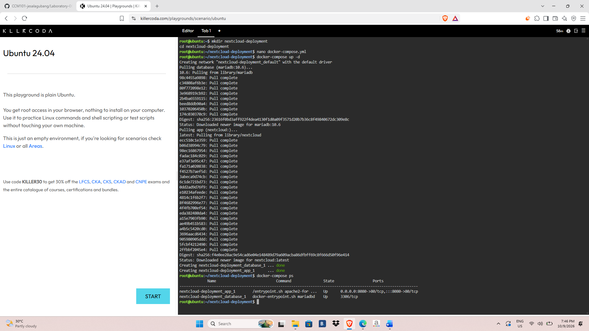
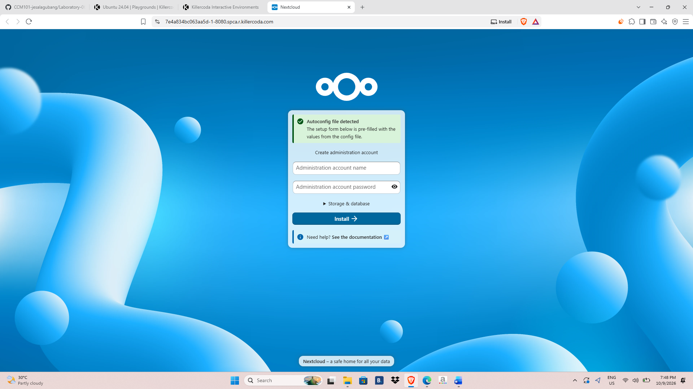
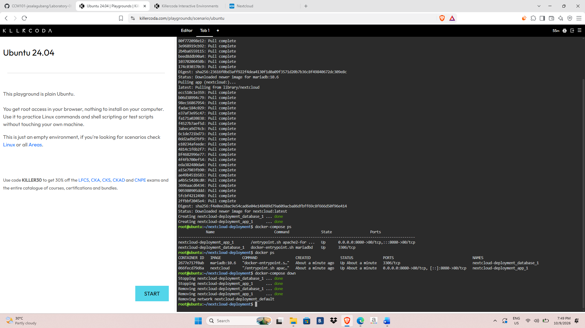

# Laboratory 06: Cloud Deployment Engineer

## Mission Overview
Deployed a two-tier private cloud storage application (Nextcloud web
application + MariaDB database) using Docker Compose and Infrastructure as
Code, then tore it down cleanly.

## Objectives
- Explain multi-tier application architecture
- Understand the structure and purpose of a docker-compose.yml file
- Create configuration files using the nano text editor
- Deploy and remove a multi-container stack with Docker Compose
- Document the deployment in Markdown

## Commands Executed
| Command | Purpose |
|---|---|
| `mkdir nextcloud-deployment` | Create the project directory |
| `cd nextcloud-deployment` | Move into the project directory |
| `nano docker-compose.yml` | Create the Compose file |
| `docker-compose up -d` | Pull images and start the stack in the background |
| `docker-compose ps` | Verify that both containers are running |
| `docker-compose down` | Stop and remove the containers and network |

## Skills Learned
- Writing YAML configuration files
- Using nano in the Linux terminal
- Deploying multi-container applications with Docker Compose
- Connecting services through service-name networking
- Passing configuration through environment variables
- Documenting infrastructure in Markdown on GitHub

## Evidence

